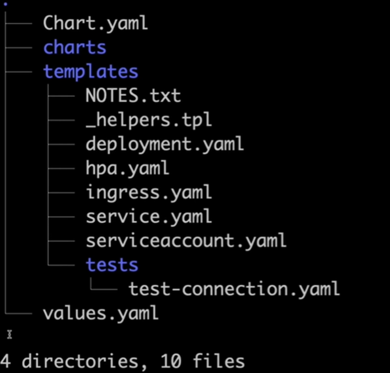
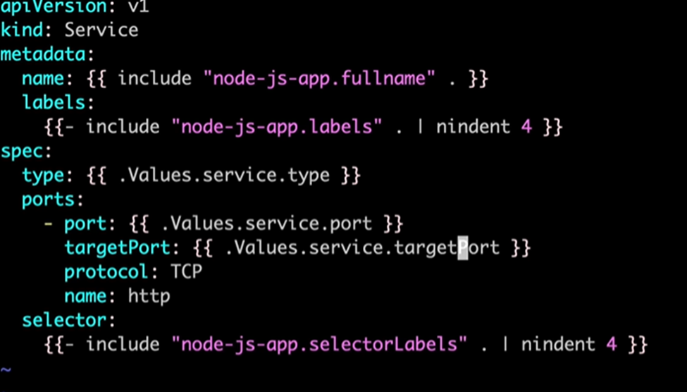

# Helm — Learning Guide

This guide explains **Helm**, **Helm Charts**, and the old **“Helm stable”** repo in clear terms, then shows simple, copy-paste steps you can run to learn the basics. This is **for learning only** (not a full project).

---

## 🧠 What is Helm?

**Helm** is the **package manager for Kubernetes**.

- A “package” is a **Chart** (templates + default values).
- Helm takes a chart + your values, **renders Kubernetes YAML**, and applies it.
- You can **install**, **upgrade**, **rollback**, and **uninstall** releases.

### What is a Helm Chart?

A **Chart** is a folder (or a `.tgz` archive) with:
- `Chart.yaml` — chart metadata (name, version, description).
- `values.yaml` — **defaults** you can override per environment.
- `templates/` — Kubernetes manifests written as **templates** that read from `values.yaml`.
- `charts/` — optional subcharts (dependencies).

### What was “Helm stable”?

- The community once maintained a single central repo called **stable**.
- It’s **deprecated**. Today you discover charts via **Artifact Hub** and add repos explicitly, for example:
    helm repo add bitnami https://charts.bitnami.com/bitnami
- TL;DR: **don’t use “stable”** now—use vendor/maintainer repos from Artifact Hub.

### Why teams use Helm (benefits)

- **Reuse:** one chart, many environments via different values.
- **Safety:** `helm rollback` quickly reverts a bad deploy.
- **History:** each install is a **release** with tracked revisions.
- **GitOps-friendly:** charts/values are YAML; easy to review in PRs.

---

## ⚙️ Install Helm

Official instructions: https://helm.sh/docs/intro/install/

    curl -fsSL -o get_helm.sh https://raw.githubusercontent.com/helm/helm/main/scripts/get-helm-3
    chmod 700 get_helm.sh
    ./get_helm.sh
    helm version

---

## 🧩 Create & Explore a Chart (Apache example)

Goal: create a chart, look at its files, set a few values, package it, and install it with different environment names.

    helm create apache-helm
    cd apache-helm
    ls
    # You should see: Chart.yaml  values.yaml  charts/  templates/  .helmignore
    tree   # optional, if 'tree' is installed

    

### Edit defaults (simple)

Open `values.yaml` and adjust minimal fields (example shown):

    replicaCount: 2

    image:
      repository: httpd
      tag: "2.4"
      pullPolicy: IfNotPresent

    service:
      type: ClusterIP
      port: 80

Note: the scaffolded Deployment template might use `nginx` by default. For learning Helm, it’s fine to keep `nginx` or switch the image to `httpd:2.4`. The key is understanding how `values.yaml` flows into templates.

### Package the chart (optional)

    helm package .
    # → creates apache-helm-<version>.tgz in the parent directory

You can install from **the folder** (`./apache-helm`) or from **the .tgz**—both work.

---

## 🚀 Install, Uninstall, Upgrade, Rollback (learning flow)

### 1) Install into current namespace

    helm install dev-apache ./apache-helm
    kubectl get pods

You’ll see pods/deployments created for the release named **`dev-apache`**.

### 2) Uninstall the release

    helm uninstall dev-apache

### 3) Install into dedicated namespaces (dev/prod style names)

    helm install dev-apache ./apache-helm -n dev-apache --create-namespace
    helm install prd-apache ./apache-helm -n prd-apache --create-namespace

### 4) Change replicas for the prod release

Edit `apache-helm/values.yaml`:

    replicaCount: 3

Apply the change with an upgrade:

    helm upgrade prd-apache ./apache-helm -n prd-apache
    kubectl get pods -n prd-apache

### 5) Roll back prod to a previous revision

    helm history prd-apache -n prd-apache
    helm rollback prd-apache 1 -n prd-apache
    kubectl get pods -n prd-apache

---

## 🔁 Second Example (Node.js chart) — files to touch

    helm create node-js-app
    ls
    tree
    cd node-js-app

Edit `Chart.yaml` (chart metadata):

    apiVersion: v2
    name: node-js-app
    description: A simple Node.js app chart
    type: application
    version: 0.1.0
    appVersion: "1.0.0"

Edit `templates/service.yaml` to use your app port (example):

    spec:
      ports:
        - port: 80
          targetPort: 3000   # Node.js container listens on 3000

          

Edit `values.yaml` to set your image and tag:

    image:
      repository: YOUR_DOCKERHUB_USERNAME/YOUR_NODE_IMAGE
      tag: "v1.0.0"

    service:
      port: 80
      targetPort: 3000

Package (optional) and install:

    helm package .
    helm install dev-node-js-app ./node-js-app -n dev-node --create-namespace
    kubectl get pods -n dev-node
    kubectl get svc  -n dev-node
    helm list -n dev-node

---

## 🧰 Helm Commands Cheat-Sheet (simple)

    helm create <name>                                          # scaffold a new chart
    helm install <release> <chart|.tgz> -n <ns> --create-namespace
    helm upgrade <release> <chart|.tgz> -n <ns> -f myvalues.yaml
    helm rollback <release> <revision> -n <ns>
    helm list -n <ns>
    helm history <release> -n <ns>
    helm uninstall <release> -n <ns>

---

## 🧠 When should I use Helm?

Use Helm when you want:
- **One chart** reused across **many environments** with different **values**.
- **Fast rollbacks** and release history.
- To **package** your app/operator so others can install it easily.
- To keep app config/tuning in **values files** (cleaner PRs than editing many raw YAMLs).

---

## 🧹 Cleanup (optional)

    helm uninstall dev-apache || true
    helm uninstall dev-apache -n dev-apache || true
    helm uninstall prd-apache -n prd-apache || true
    helm uninstall dev-node-js-app -n dev-node || true

---

## ✅ Summary

- **Helm** = Kubernetes package manager.  
- **Charts** bundle templates + defaults; **values** let you tweak per environment.  
- The old **“stable”** repo is deprecated—use repos from **Artifact Hub**.  
