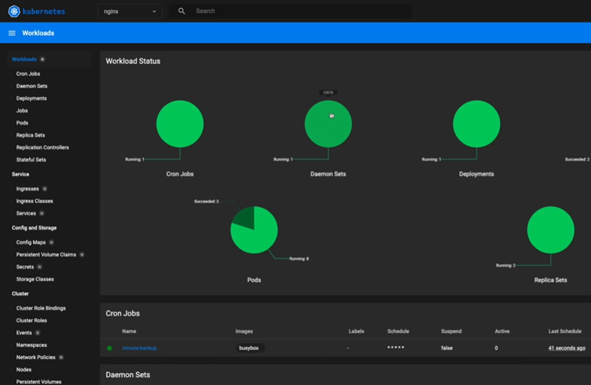

# Kubernetes RBAC (Cluster-Level) + Dashboard 

This README explains **cluster-level RBAC** (what/why/real production use-cases), shows how to **set up Kubernetes Dashboard**, 

---

## 🧠 RBAC (Cluster Level): What, Why, Production Use Cases

**What is RBAC?**  
Role-Based Access Control defines **who** (users, groups, service accounts) can **do what** (verbs: get, list, watch, create, update, patch, delete) on **which resources** (pods, deployments, nodes, etc.) and in **what scope**:
- **Namespace scope** → `Role` + `RoleBinding`
- **Cluster scope** → `ClusterRole` + `ClusterRoleBinding`

**Why cluster-level RBAC in production**
- **Least privilege & blast-radius control**: only platform/SRE identities get cluster-wide permissions.
- **Separation of duties**: app teams get namespace roles; cluster operators get cluster roles.
- **Controller access**: GitOps, admission controllers, and observability agents often need cluster-scoped rights.

**Common production use cases**
- **Cluster administrators / SREs**: manage nodes, CRDs, storage, CNI; often via curated `ClusterRole`s or (sparingly) `cluster-admin`.
- **Dashboards / Monitoring**: cluster-wide read (`get/list/watch`) for metrics/dashboards.
- **Operators / Controllers (Argo CD, cert-manager, ALB controller, etc.)**: manage CRDs across all namespaces via `ClusterRoleBinding`.

---

## 📊 Kubernetes Dashboard — What It Creates

When you apply the recommended Dashboard manifest, it deploys:
- Namespace **`kubernetes-dashboard`**
- **ServiceAccount**, **Roles/ClusterRoles**, and **RoleBindings/ClusterRoleBindings** for the dashboard
- **Deployment** and HTTPS **Service** for the web UI
- Supporting resources (e.g., Secrets, ConfigMaps)

Install (as provided):
    
    kubectl apply -f https://raw.githubusercontent.com/kubernetes/dashboard/v2.7.0/aio/deploy/recommended.yaml

You can list ClusterRoles (note: ClusterRoles are cluster-scoped; the `-n` flag is ignored but shown here as you wrote it):
    
    kubectl get clusterrole -n kubernetes-dashboard

---

## 🔐 Create a Cluster-Level Admin Login for the Dashboard

Create **dashboard-admin-user.yml**:

    # ServiceAccount for login
    apiVersion: v1
    kind: ServiceAccount
    metadata:
      name: admin-user
      namespace: kubernetes-dashboard
    ---
    # ClusterRoleBinding that grants cluster-admin to the SA above
    apiVersion: rbac.authorization.k8s.io/v1
    kind: ClusterRoleBinding
    metadata:
      name: admin-user-binding
      namespace: kubernetes-dashboard
    subjects:
    - kind: ServiceAccount
      name: admin-user
      namespace: kubernetes-dashboard
    roleRef:
      apiGroup: rbac.authorization.k8s.io
      kind: ClusterRole
      name: cluster-admin

Apply it:

    kubectl apply -f dashboard-admin-user.yml

Get a login token for that ServiceAccount:

    kubectl -n kubernetes-dashboard create token admin-user

Copy the token. Start a local proxy (as you wrote):

    kubectl proxy --port=8001 --address=0.0.0.0 --accept-host='.*'

Open the Dashboard in a browser and paste the token:

    http://localhost:8001/api/v1/namespaces/kubernetes-dashboard/services/https:kubernetes-dashboard:/proxy/

> ⚠️ **Security note**: Prefer **OIDC** login (SSO) and avoid cluster-admin tokens for daily use. Use **read-only cluster roles** for most dashboard users.

---

## 📁 Manifests

- `namespace.yml`
- `deployment.yml`
- `replicasets.yml`
- `daemonsets.yml`
- `job.yml`
- `cron-job.yml`
- `ingress.yml`
- `service.yml`
- `pod.yml`
- `persistentVolume.yml`
- `persistentVolumeClaim.yml`

> We’ll deploy exactly these, in this order, so that **PV/PVC** bind before workloads.

---

## ▶️ Deploy the Demo and View It in Dashboard

1) Create namespace:

    kubectl apply -f namespace.yml

2) Create storage (as you instructed):

    kubectl apply -f persistentVolume.yml
    kubectl apply -f persistentVolumeClaim.yml

3) Apply **everything else** (same folder):

    kubectl apply -f .

4) Verify in CLI:

    kubectl get all -n nginx

5) Open **Kubernetes Dashboard** (Namespace selector → choose **nginx**)  
   You’ll see **CronJobs, DaemonSets, Deployments, Pods, ReplicaSets**, Services, and the bound **PVC**

   

---

## 🧪 Helpful Checks

    # What am I authenticated as?
    kubectl auth whoami

    # Do I have access cluster-wide?
    kubectl auth can-i list nodes

    # Example: see everything in 'nginx'
    kubectl get deploy,rs,po,svc,ing,job,cronjob -n nginx

    # Persistent storage
    kubectl get pv
    kubectl get pvc -n nginx
    kubectl describe pvc -n nginx

---

## 🛡️ Notes

- Avoid using **cluster-admin** for humans; create **read-only** or **least-privileged** ClusterRoles.
- Bind **namespace-scoped Roles** to app **ServiceAccounts** (one per workload), not the `default` SA.
- Store RBAC manifests in Git and review via PR (GitOps).
- Rotate tokens; prefer OIDC SSO for Dashboard and CLI.
- Pair RBAC with **NetworkPolicies**, **Pod Security**, **image scanning**, and **audit logs**.

---

## 📚 RBAC: Namespace Level vs Cluster Level

| Dimension | Namespace Level (`Role` + `RoleBinding`) | Cluster Level (`ClusterRole` + `ClusterRoleBinding`) |
|---|---|---|
| **Scope** | Single namespace | All namespaces and cluster-scoped resources |
| **Common resources** | Pods, Services, Deployments, ConfigMaps within one namespace | Nodes, PersistentVolumes, CRDs, Namespaces; or the same namespaced resources across all namespaces |
| **Typical subjects** | App **ServiceAccounts**, team-specific users | Platform/SRE groups, controllers/operators (Argo CD, ingress/ALB controller, cert-manager) |
| **Use cases** | Least-privileged app runtime, CI/CD limited to one namespace | Cluster operations, cross-namespace controllers, dashboards needing cluster-wide read |
| **Risk** | Lower—blast radius limited to the namespace | Higher—misconfig impacts entire cluster |
| **Best practice** | One SA per workload; bind only needed verbs | Curated ClusterRoles; avoid `cluster-admin` except for bootstrap/break-glass |
| **Binding object** | `RoleBinding` (namespaced) | `ClusterRoleBinding` (cluster-scoped) |

---

## 🧹 Cleanup

    # Remove your demo workloads
    kubectl delete -f . || true

    # Remove dashboard admin binding & SA
    kubectl delete -f dashboard-admin-user.yml || true

    # (If you installed the dashboard and want to remove it)
    kubectl delete -f https://raw.githubusercontent.com/kubernetes/dashboard/v2.7.0/aio/deploy/recommended.yaml || true

---

