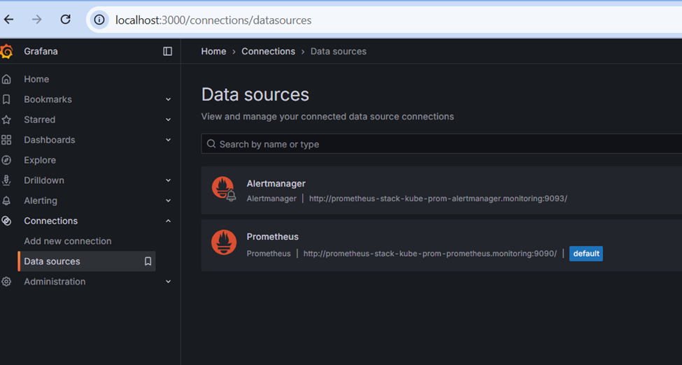

# Kubernetes 360° Monitoring — Prometheus, Alertmanager & Grafana (via Helm)

This README walks you through a **production-friendly, end-to-end (360°)** monitoring setup for a Kubernetes cluster using the `kube-prometheus-stack` Helm chart (Prometheus + Alertmanager + Grafana) plus the core exporters (`node-exporter`, `kube-state-metrics`) and CRDs (`ServiceMonitor`, `PodMonitor`, `PrometheusRule`). 

---

## 📦 What you deploy

1. **Prometheus Operator (now in kube-prometheus-stack)**  
   - Manages Prometheus/Alertmanager/Grafana as Kubernetes objects.  
   - Reconciles desired state from CRDs (e.g., `ServiceMonitor`) into live Prometheus configs.

2. **Prometheus**  
   - Time-series database + scraper.  
   - Pulls metrics from:
     - **kube-state-metrics** (cluster object health & counts),
     - **node-exporter** (node/OS metrics),
     - **cAdvisor** via Kubelet (container/pod metrics),
     - **your apps** (via `ServiceMonitor`/`PodMonitor`).  
   - Stores & evaluates **rules** (recording rules, alerting rules).

3. **Alertmanager**  
   - Receives alerts from Prometheus; groups, de-duplicates, routes and notifies (email, Slack, PagerDuty, Webhook, etc.).

4. **Grafana**  
   - Visualization.  
   - Pre-provisioned dashboards + Prometheus datasource.  
   - Use for ad-hoc exploration and on-call dashboards.

5. **kube-state-metrics**  
   - Exposes cluster object state (Deployments, Nodes, Pods, etc.) as metrics. Not scraped directly by you; Prometheus does.

6. **node-exporter**  
   - Runs on each node (DaemonSet). Exposes host OS metrics (CPU, memory, disk, filesystem, network).

7. **CRDs for discovery & rules**  
   - `ServiceMonitor` / `PodMonitor`: Declarative discovery of scrape targets (apps, pods, services).  
   - `PrometheusRule`: Recording and alerting rules as Kubernetes objects.

8. **(Optional) Ingress**  
   - If you choose to publish Grafana/Prometheus/Alertmanager via an Ingress controller in prod. Otherwise, use `kubectl port-forward` for local access.

---

## ✅ Prerequisites

- A working Kubernetes cluster with `kubectl` context pointed at it.
- Cluster has outbound internet access to pull Helm charts and container images.
- Admin privileges (cluster-wide CRD install + namespace creation).

---

## ⬇️ Install Helm (one time per admin workstation)

> If Helm is already installed, skip this section.

    curl -fsSL -o get_helm.sh https://raw.githubusercontent.com/helm/helm/main/scripts/get-helm-3
    chmod 700 get_helm.sh
    ./get_helm.sh

Verify:

    helm version

---

## 🧰 Create a dedicated `monitoring` namespace

    kubectl get ns
    kubectl create namespace monitoring
    kubectl get ns

---

## 📥 Add chart repo and install `kube-prometheus-stack`

Add and update repos:

    helm repo add prometheus-community https://prometheus-community.github.io/helm-charts
    helm repo update

> Use a **values file** to pin settings (persistence, retention, resources, RBAC).

Example `values.yaml` (safe defaults; tweak as needed):

    prometheus:
      prometheusSpec:
        retention: 15d
        scrapeInterval: 30s
        evaluationInterval: 30s
        resources:
          requests:
            cpu: 200m
            memory: 1Gi
          limits:
            cpu: 1
            memory: 4Gi
        storageSpec:
          volumeClaimTemplate:
            spec:
              accessModes: ["ReadWriteOnce"]
              resources:
                requests:
                  storage: 20Gi

    alertmanager:
      alertmanagerSpec:
        resources:
          requests:
            cpu: 50m
            memory: 256Mi
          limits:
            cpu: 500m
            memory: 512Mi
        storage:
          volumeClaimTemplate:
            spec:
              accessModes: ["ReadWriteOnce"]
              resources:
                requests:
                  storage: 5Gi

    grafana:
      adminUser: admin
      adminPassword: "change-me" # Use a Secret in real prod
      persistence:
        enabled: true
        size: 5Gi
      service:
        type: ClusterIP

Install (or upgrade) with your chosen release name, e.g. `prometheus-stack`:

    helm upgrade --install prometheus-stack prometheus-community/kube-prometheus-stack \
      --namespace monitoring \
      --create-namespace \
      -f values.yaml

Wait for everything to come up:

    kubectl -n monitoring get pods
    kubectl -n monitoring rollout status deploy/prometheus-stack-grafana
    kubectl -n monitoring rollout status statefulset/prometheus-prometheus-stack-kube-prom-prometheus
    kubectl -n monitoring rollout status statefulset/alertmanager-prometheus-stack-kube-prom-alertmanager

List CRDs (installed by the chart):

    kubectl get crd | grep -E 'monitor|prometheus|alertmanager|grafana'

---

## 🔌 Accessing the UIs (local dev via port-forward)

Prometheus UI:

    kubectl port-forward svc/prometheus-stack-kube-prom-prometheus 9090:9090 -n monitoring --address=0.0.0.0

Grafana UI:

    kubectl port-forward svc/prometheus-stack-grafana 3000:80 -n monitoring --address=0.0.0.0

Get Grafana admin password (autogenerated if you didn’t set one):

    kubectl --namespace monitoring get secrets prometheus-stack-grafana \
      -o jsonpath="{.data.admin-password}" | base64 --decode ; echo

> Open Grafana at `http://localhost:3000` (user: `admin`, password from the command above).

Alertmanager UI (optional):

    kubectl port-forward svc/prometheus-stack-kube-prom-alertmanager 9093:9093 -n monitoring --address=0.0.0.0

---

## 🔎 Using Prometheus & Grafana

**Prometheus UI**  
- **Targets**: Verify what’s scraped (`/targets`).  
- **Rules**: View firing alerts & recording rules.  
- Query with **PromQL** (examples):
    - `up` – who’s up/down.
    - `rate(container_cpu_usage_seconds_total[5m])` – container CPU rate.
    - `kube_pod_container_status_restarts_total` – restarts by container.
    - `node_memory_MemAvailable_bytes / node_memory_MemTotal_bytes` – node memory available ratio.

**Grafana**  
- Pre-built dashboards (`Kubernetes / Compute Resources / Cluster`, `Nodes`, `Pods`, etc.).  
- Create folders, import dashboards by ID from Grafana.com.  
- Provision teams & alerts (contact points) in production.

---

## 🧩 Scraping your application (ServiceMonitor / PodMonitor)

If your app exposes `/metrics` on port `http` and is labeled `app: my-api`, a minimal `ServiceMonitor`:

    apiVersion: monitoring.coreos.com/v1
    kind: ServiceMonitor
    metadata:
      name: my-api
      namespace: monitoring
    spec:
      namespaceSelector:
        matchNames: ["default"]     # namespace where the Service lives
      selector:
        matchLabels:
          app: my-api               # labels on the Service
      endpoints:
        - port: http                # name of the Service port
          path: /metrics
          interval: 30s
          scrapeTimeout: 10s

> Make sure your **Service** object has a **named port** `http` that maps to the actual container port.

Alternatively, scrape pods directly with `PodMonitor` (useful when Services aren’t stable).

---

## 🚨 Alerting 101 (PrometheusRule & Alertmanager)

Sample `PrometheusRule` with two simple alerts:

    apiVersion: monitoring.coreos.com/v1
    kind: PrometheusRule
    metadata:
      name: platform-alerts
      namespace: monitoring
      labels:
        release: prometheus-stack
    spec:
      groups:
      - name: basic.rules
        rules:
        - alert: HighPodRestart
          expr: rate(kube_pod_container_status_restarts_total[15m]) > 0.1
          for: 10m
          labels:
            severity: warning
          annotations:
            summary: "Pod is restarting frequently"
            description: "Container restarts > 0.1 per 15m in {{ $labels.namespace }}/{{ $labels.pod }}"
        - alert: NodeDiskPressure
          expr: kube_node_status_condition{condition="DiskPressure",status="true"} == 1
          for: 5m
          labels:
            severity: critical
          annotations:
            summary: "Node under disk pressure"
            description: "Node {{ $labels.node }} reports DiskPressure"

**Alertmanager routing** (Helm values-based snippet):

    alertmanager:
      config:
        route:
          receiver: "team-slack"
          group_by: ["alertname","namespace"]
          group_wait: 30s
          group_interval: 5m
          repeat_interval: 3h
          routes:
            - matchers:
                - severity = "critical"
              receiver: "oncall"
        receivers:
          - name: "team-slack"
            slack_configs:
              - api_url: https://hooks.slack.com/services/XXX/YYY/ZZZ
                channel: "#ops"
                send_resolved: true
          - name: "oncall"
            pagerduty_configs:
              - routing_key: YOUR_PD_ROUTING_KEY
                severity: "critical"

Apply by updating your Helm values and running `helm upgrade`.

---

## 🔐 RBAC & Least Privilege

The chart creates required RBAC for its own components. For **your apps’ metrics**, avoid cluster-admin:  
- Expose metrics via a normal Service.  
- `ServiceMonitor` lives in `monitoring` (or same namespace); uses label selection only.  
- No extra privileges are needed.

---

## 🧱 Persistence & Retention (Production)

- **Prometheus storage**: plan capacity for time-series retention, cardinality, and scrape frequency. Example above uses `20Gi` and `15d`.  
- **HA Prometheus**: run **two** Prometheus replicas behind the Operator with the **same** rule & scrape config (requires remote-write or Thanos/Cortex/Mimir for true HA reads).  
- **Grafana persistence**: enable PVC to retain dashboards and data-sources (or provision via code).

---

## 🌐 Optional Ingress (expose UIs behind auth)

Example minimal Ingress for Grafana (adapt host & class):

    apiVersion: networking.k8s.io/v1
    kind: Ingress
    metadata:
      name: grafana-ingress
      namespace: monitoring
      annotations:
        nginx.ingress.kubernetes.io/ssl-redirect: "false"
    spec:
      ingressClassName: nginx
      rules:
      - host: grafana.local.test
        http:
          paths:
          - path: /
            pathType: Prefix
            backend:
              service:
                name: prometheus-stack-grafana
                port:
                  number: 80

> Protect with SSO or basic auth in real environments.

---

## 🧪 Commands (mapped to this guide)

- Helm install:

    curl -fsSL -o get_helm.sh https://raw.githubusercontent.com/helm/helm/main/scripts/get-helm-3
    chmod 700 get_helm.sh
    ./get_helm.sh

- Namespace created:

    kubectl get ns
    kubectl create namespace monitoring
    kubectl get ns

- Local access via port-forward (correct service names):

    kubectl port-forward svc/prometheus-stack-kube-prom-prometheus 9090:9090 -n monitoring --address=0.0.0.0
    kubectl port-forward svc/prometheus-stack-grafana 3000:80 -n monitoring --address=0.0.0.0

- Get Grafana admin password (base64 decode):

    kubectl --namespace monitoring get secrets prometheus-stack-grafana -o jsonpath="{.data.admin-password}" | base64 --decode ; echo

---

## Creating & Managing Your Own Grafana Dashboards

- **Browse & Import Community Dashboards**  
  Explore thousands of ready-made dashboards at https://grafana.com/grafana/dashboards/. Copy the **Dashboard ID** and import it in Grafana: *Dashboards → New → Import → Enter ID → Select Prometheus datasource*.

- **Import from JSON**  
  You can also paste JSON or upload a `.json` file exported from another Grafana:
    - *Dashboards → New → Import → Upload JSON file*  
    - Keep the **UID** unique (Grafana will warn if a UID collision happens).

- **Provision as Code (recommended for prod)**  
  Store dashboards in git and let Grafana auto-load them on startup. In `values.yaml` (for kube-prometheus-stack), point a provisioning folder and mount dashboards as ConfigMaps/Secrets. Example (values snippet):
    
    grafana:
      dashboardsProvider:
        enabled: true
      dashboardsConfigMaps:
        default: "my-grafana-dashboards"   # ConfigMap name with JSON dashboards
      sidecar:
        dashboards:
          enabled: true
          label: grafana_dashboard
          folder: /var/lib/grafana/dashboards

  Then create a ConfigMap with your dashboard JSONs and label it `grafana_dashboard: "1"`.

- **Use Variables & Templating**  
  Add variables (namespace, pod, job, node) to make dashboards reusable across environments. Prefer **label values** from Prometheus (e.g., `label_values(kube_pod_info, namespace)`).

- **Panels that matter for K8s**  
  - **Cluster health**: API server latency, etcd health (if accessible), scheduler/controller metrics.  
  - **Nodes**: CPU saturation, memory pressure, disk IO, filesystem inodes, network.  
  - **Workloads**: Pod restarts, container CPU/mem, OOM kills, throttling, HPA/VPA signals.  
  - **Control plane**: kube-state-metrics errors, scrape status (`up`), target down counts.  
  - **SLOs**: Error rate, latency (P50/P90/P99), availability burn rate panels.

- **Transformations & Annotations**  
  Use **Transformations** to group/summarize series (e.g., top N by CPU). Add **Annotations** from Alertmanager or deployment events for on-call context.

- **Linking & Drilldowns**  
  Add panel links to related dashboards (e.g., from cluster → node → pod) and data links to Prometheus queries for deeper investigation.

- **Dashboard Permissions & Folders**  
  Organize by team or environment. Restrict edit rights in production—use provisioning and PR reviews for changes.

- **Alerting from Panels**  
  Attach alerts to panels (Grafana Alerting) or keep rules in Prometheus/Alertmanager. In prod, standardize severity labels and notification policies.

- **Performance & Cardinality Tips**  
  Prefer **recording rules** for heavy queries. Limit wildcards on high-cardinality labels (e.g., `pod`, `container`). Use panel-level time ranges for expensive views.

- **Export/Backup**  
  Export JSON for backups or recreate via provisioning. Keep dashboard JSONs in source control alongside application code.

---

## 🛠️ Essential commands & workflows

**Helm lifecycle**

    # Install / upgrade with pinned values
    helm upgrade --install prometheus-stack prometheus-community/kube-prometheus-stack -n monitoring -f values.yaml

    # Diff (if you use helm-diff plugin)
    helm diff upgrade prometheus-stack prometheus-community/kube-prometheus-stack -n monitoring -f values.yaml

    # Roll back if needed
    helm rollback prometheus-stack <REVISION> -n monitoring

**Health checks**

    kubectl -n monitoring get pods
    kubectl -n monitoring get svc
    kubectl -n monitoring get endpoints
    kubectl -n monitoring get prometheus,alertmanager,grafana
    kubectl -n monitoring get servicemonitors,podmonitors,prometheusrules

**Logs & events**

    kubectl -n monitoring logs deploy/prometheus-stack-grafana
    kubectl -n monitoring logs statefulset/prometheus-prometheus-stack-kube-prom-prometheus
    kubectl -n monitoring logs statefulset/alertmanager-prometheus-stack-kube-prom-alertmanager
    kubectl -n monitoring describe pod <podName>
    kubectl -n monitoring get events --sort-by=.metadata.creationTimestamp

**Targets & rules (Prometheus UI)**

    # Open the Prometheus UI (via port-forward) and check:
    #   /targets  - scrape status
    #   /rules    - recording & alert rules
    #   /alerts   - active firing alerts
    #   /graph    - run PromQL queries

**Debug discovery**

    # Ensure your Service has a named port that matches the ServiceMonitor endpoint 'port' field
    kubectl -n <ns> get svc <your-service> -o yaml

    # Check ServiceMonitor selection
    kubectl -n monitoring get servicemonitor <name> -o yaml

**Silences & on-call**

    # Manage silences via Alertmanager UI or API
    kubectl port-forward svc/prometheus-stack-kube-prom-alertmanager 9093:9093 -n monitoring

**Backup considerations**

    # Snapshot Prometheus data by snapshot API or stop-the-world PVC copy (off-hours)
    # Export Grafana dashboards via API or store them as code (provisioning folder + git)

**Upgrades**

    # Before upgrading across chart/CRD major versions:
    helm repo update
    helm show chart prometheus-community/kube-prometheus-stack
    # Read release notes; test in staging; apply with helm-diff.

---

## 🔍 Troubleshooting quick wins

- **Targets down?** Check `/targets` in Prometheus. Fix Service labels / named ports for ServiceMonitor selection.  
- **High cardinality / OOM?** Reduce scrape interval, limit label churn, add recording rules, increase Prometheus resources.  
- **No dashboards?** Grafana depends on sidecar to pick ConfigMaps/Secrets. Ensure it’s running and you enabled persistence or provisioning.  
- **Alerts not routing?** Verify `alertmanager.config` in values, test with `/api/v2/alerts` POST or temporary alert rule.  
- **Node exporter missing?** It’s a DaemonSet. Confirm it’s scheduled on all nodes (taints/tolerations, security context).

---

## 🧭 Architecture recap (mapping to your 360° diagram)

- **Master / Control-Plane & Workers**: kubelet exposes `/metrics` (includes cAdvisor).  
- **node-exporter** on each node (port 9100) for OS metrics.  
- **kube-state-metrics** scrapes the API server for object state and republishes as metrics.  
- **Prometheus** centrally scrapes all targets, evaluates rules, persists time-series.  
- **Alertmanager** handles notifications & deduplication.  
- **Grafana** visualizes Prometheus data.  
- **Helm** installs/maintains this entire stack declaratively and repeatably.

---

